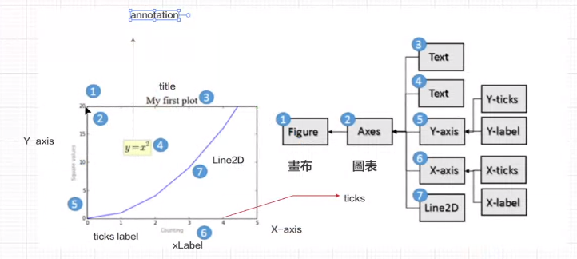
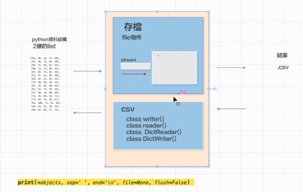

## Python 終端機指令
不管衝突 強制上傳  終端機指令 git push -f
## Codespaces核心無法執行
建立資料夾 .devcontainer 
建立檔案   devcontainer.json
輸入程式碼 要求虛擬機使用Python 3
重啟Codespaces
vscode 改語言 CTRL+SHIFT+P 選 CONFIGURE DISPLAY LANGUAGE

list csv關聯

matplotlib
